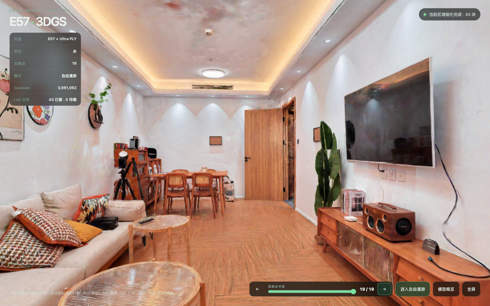

# E57 → 3D Gaussian Splatting · Spatial LoD Demo

一个可以直接放到 GitHub Pages 的 3DGS 演示项目：从米制 E57 点云和扫描位姿出发，
制作可在 Three.js 中连续自由漫游的 Gaussian Splat 场景，并用相加式空间 LoD 把一个
过大的 SPZ 拆成可渐进加载的分块。



这个仓库展示的是完整的工程链路，而不是只展示一个静态模型：

- E57 元数据、点云、扫描位姿和全景图 → COLMAP 训练数据；
- OpenSplat / SH Gaussian PLY → 可审计的清理和精度边界；
- 60 mm / 20 mm / 原始细节三层相加式 LoD → 2 m 空间分块；
- Spark SPZ → Three.js 运行时按视锥、距离和内存预算加载；
- GitHub Actions → 测试、SPZ 完整性检查和 GitHub Pages 部署。

## 直接运行演示

网页演示资产已经随仓库放在 `viewer/public/lod/`。不需要 E57、PLY 或本机训练环境即可
启动查看器：

```bash
cd viewer
npm ci
npm run validate:lod
npm run dev
```

打开终端显示的本地地址。生产构建和预览：

```bash
npm run build
npm run preview -- --host 127.0.0.1 --port 4173
```

Vite 使用相对资源路径，因此放到 `https://<user>.github.io/<repo>/` 这样的 GitHub Pages
子路径也能工作。仓库的 `Deploy 3DGS demo` workflow 会在 `main` 更新后构建并发布
`viewer/dist/`；第一次使用时，在 GitHub 仓库的 Settings → Pages 中将 Source 设为
GitHub Actions。

如果要把较大的 LoD 资产放到 CDN，只需在构建时指定 manifest：

```bash
VITE_LOD_MANIFEST_URL=https://cdn.example.com/p4-lod/manifest.json npm run build
```

CDN 需要允许当前网页 Origin 的 CORS 请求，并保持 manifest 中的相对 `d0/`、`d1/`、
`d2/` 路径可访问。

## 交互

- 点击场景或 `Enter free roam` 后，鼠标拖动环视；`W/S` 前后，`A/D` 横移，`Q/E` 升降，
  `Shift` 加速，`Esc` 退出；方向键也可移动。
- `Reset view` 返回当前观测点，`Overview` 查看整体范围，`R` / `O` 是对应快捷键，`H` 打开
  `Quick Guide`；`C` 切换清屏模式。
- 默认地址使用空间 LoD 渐进加载；点击 `Full detail`，或打开
  `?quality=full`，会从基础层开始加载全部 63 个细节分块（约 100 MB / 6,201,720 Gaussian）。
- `?clean=1` 打开无 HUD 的清屏版本；演示时可以组合为
  `?quality=full&clean=1`，得到全量精细、无界面的版本。
- 19 个采集站是观测书签，不是移动限制；相机可以在站点之间连续移动，也可以离开点云
  覆盖区。
- 离开有效覆盖区时，细节分块会被回收，只留下基础层；回到场景后按需重新加载。
- `Overview` 只用于检查整体范围，不代表训练数据提供了室外全视角。

## LoD 资产

网页发布的是同一个清理后 Gaussian 集合的互不重叠分区，三层合并后精确恢复全部点：

| 层级 | 内容 | Gaussian | 文件数 |
| --- | --- | ---: | ---: |
| d0 | 60 mm 全局基础层 | 301,195 | 1 |
| d1 | 20 mm 中等细节增量 | 1,868,394 | 32 |
| d2 | 原始细节增量 | 4,032,131 | 31 |

- 完整集合：6,201,720 Gaussian / 100,262,962 bytes；
- 首屏基础层：5,153,904 bytes（约 4.92 MiB），相比单体 SPZ 减少 94.96%；
- 最大单个细节块：3,809,044 bytes；
- 默认驻留预算：64 MiB / 4,000,000 Gaussian，最多 2 个并发加载；
- Full detail 模式预算：128 MiB / 7,000,000 Gaussian，最多 4 个并发加载，确保全量细节不被空间 LoD 回收；
- SPZ 使用 SH3、12-bit fractional coordinate，manifest 对每个文件记录 SHA-256、字节数、
  splat 数和 SPZ header。

运行时实现位于 [`viewer/src/lod-manager.js`](viewer/src/lod-manager.js)，资产生成位于
[`src/e57gs/lod_tiles.py`](src/e57gs/lod_tiles.py)，PLY → SPZ 的批量转换位于
[`viewer/scripts/convert-lod-spz.mjs`](viewer/scripts/convert-lod-spz.mjs)。

## 从 E57 重新制作

仓库不包含原始扫描文件。准备好本地 E57 后，可以复现数据准备阶段：

```bash
uv sync --locked --dev

uv run e57gs inspect /path/to/scan.e57 --crc
uv run e57gs prepare \
  /path/to/scan.e57 \
  artifacts/dataset \
  --size 2048 \
  --fov 90 \
  --pitches=-25,0,25 \
  --voxel-size 0.03 \
  --polar-cap 20 \
  --skip-crc
```

在 OpenSplat 中训练出以米为单位、保留原始坐标系的 Gaussian PLY 后，执行清理和 LoD：

```bash
uv run python scripts/validate_gaussian_ply.py artifacts/dataset/training/scene.ply
uv run python scripts/filter_gaussian_ply.py \
  artifacts/dataset/training/scene.ply \
  artifacts/dataset/training/scene_clean.ply \
  --min-opacity 0.03 \
  --scale-mode needle \
  --max-scale-m 0.10 \
  --second-scale-m 0.05 \
  --min-aspect-ratio 4

uv run python scripts/split_gaussian_lod.py \
  artifacts/dataset/training/scene_clean.ply \
  artifacts/lod_source

cd viewer
npm ci
npm run convert:lod -- \
  ../artifacts/lod_source/manifest.source.json \
  ../artifacts/lod_publish \
  3
```

转换器拒绝覆盖已有目录，也会在任意 SPZ 坐标 clipping、header 数量不一致或转换结果缺失
时失败。把验证通过的 `lod_publish/` 复制为 `viewer/public/lod/` 后，运行
`npm run validate:lod && npm run build`。

OpenSplat 的 Apple Silicon / MPS 构建、训练参数、E57 坐标约定、精度边界和 P4 案例的
完整实测记录见 [`BUILD_REPORT_P4_ULTRA.md`](BUILD_REPORT_P4_ULTRA.md)。

## 仓库结构

```text
src/e57gs/                  E57、点云、COLMAP、Gaussian 和 LoD Python 模块
scripts/                    清理、验证、重建和 LoD 分块 CLI
tests/                      单元测试与可选本地 E57 集成测试
viewer/src/                 Three.js / Spark 查看器和空间 LoD 调度器
viewer/scripts/             SPZ 转换器和发布资产完整性验证器
viewer/public/lod/          随仓库发布的 64 个演示 SPZ 与 manifest
.github/workflows/          CI 和 GitHub Pages 部署
docs/                       公开资产边界与演示说明
```

原始 E57、PLY、全景、训练 checkpoint、COLMAP 数据集、`artifacts/`、`output/`、
`node_modules/` 和 `viewer/dist/` 都被 `.gitignore` 排除。不要通过 `git add -f` 绕过这条
边界；派生 Gaussian 场景也可能暴露被扫描的建筑或室内内容。

## 坐标、精度与限制

源数据使用右手系、Z-up、单位米；查看器只在 Three.js 根节点转换为 Y-up，SPZ 内的数值仍
保持米制源坐标。SPZ 的 12-bit fractional coordinate 对应约 0.244 mm 的名义量化网格，
不等价于整场景表面都具有 0.244 mm 的可测精度。实际质量还受扫描噪声、遮挡、训练视差和
Gaussian 拟合影响。

本案例有 19 个采集站，适合展示室内技术样片和连续漫游；采集区外、墙后和缺少真实视差
的方向仍可能出现缺失或漂浮。要支持生产级任意视角，需要补采更多真实相机中心，而不是
单纯把同一张全景切成更多图片。

## 验证

```bash
uv sync --locked --dev
uv run pytest -q

cd viewer
npm ci
npm run validate:lod
npm run build
```

当前本机验收：Python `18 passed, 2 skipped`；LoD 三份发布目录逐文件 SHA-256、字节数、
header 和 Gaussian 数量一致；浏览器实机验证过首屏基础层、跨分块漫游、离开覆盖区回收、
回到观测站重新加载，以及 0 errors / 0 warnings。

## 公开前检查

请先阅读 [`docs/ASSET_POLICY.md`](docs/ASSET_POLICY.md)。本仓库代码使用
[MIT License](LICENSE)，但许可证只覆盖本项目代码，不自动授予 P4 派生场景或其他扫描
数据的公开使用权。Spark、Three.js、Vite 等依赖保留各自许可证；OpenSplat 的 AGPLv3
边界见制作报告。
